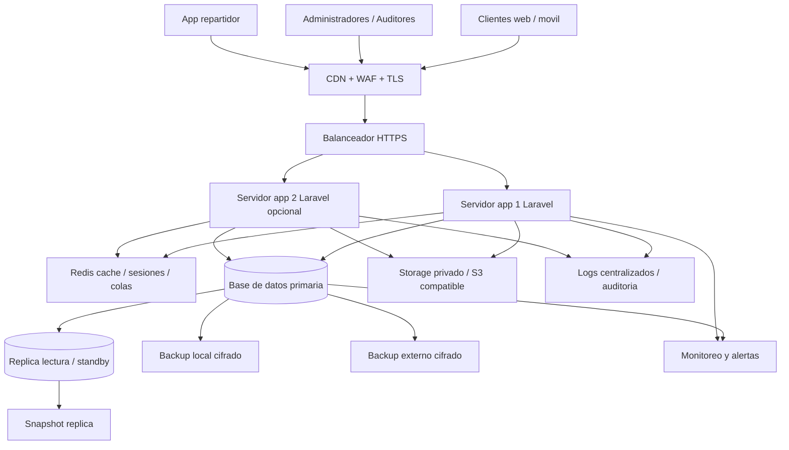
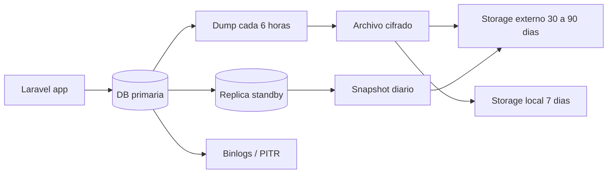
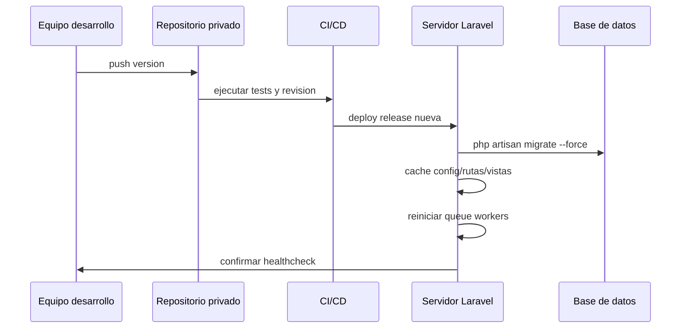

# Plano de arquitectura, seguridad y respaldo

Proyecto: Comercializadora Alimentos  
Aplicacion: Laravel 13, PHP 8.4+, MySQL/MariaDB, app repartidor y modulos admin/cliente/central/auditor  
Objetivo: preparar una arquitectura robusta para subir a servidor con seguridad alta, trazabilidad y continuidad operacional.

## 1. Vista general



## 2. Capas recomendadas

### Capa publica

- DNS apuntando a CDN o WAF.
- HTTPS obligatorio con TLS 1.3.
- Redireccion forzada de HTTP a HTTPS.
- WAF con reglas contra SQL injection, XSS, bots y fuerza bruta.
- Rate limit por IP para login, QR voucher, tracking y API repartidor.
- No exponer puertos de base de datos a internet.

### Capa aplicacion

- Servidor Linux LTS.
- Nginx como proxy web.
- PHP-FPM dedicado para Laravel.
- Supervisor para colas.
- Cron del sistema para `php artisan schedule:run`.
- Deploy con usuario sin privilegios root.
- Directorios `storage` y `bootstrap/cache` con permisos controlados.
- `.env` fuera del repositorio y con permisos restrictivos.

### Capa base de datos

- MySQL 8 o MariaDB estable.
- Base primaria privada.
- Replica secundaria en otra maquina o servicio administrado.
- Backups cifrados con retencion.
- Usuario de aplicacion con permisos limitados solo sobre su base.
- Usuario separado solo para backups.

### Capa archivos

- Fotos de productos, mascotas, repartidores y comprobantes en storage privado o S3 compatible.
- URLs publicas firmadas para archivos sensibles.
- Separar archivos publicos de archivos internos.
- Antivirus o validacion extra para cargas de imagen en produccion.

## 3. Seguridad maxima recomendada

### Autenticacion

- Admin y auditor con 2FA TOTP obligatorio.
- Cierre por inactividad: 60 minutos para roles sensibles.
- Passwords con minimo 12 caracteres en produccion.
- No usar claves por defecto.
- Cambio obligatorio de clave al primer acceso.
- Bloqueo temporal tras intentos fallidos.
- Registro de IP, navegador y fecha de ultimo acceso.

### Autorizacion

Roles base:

- `admin`: configuracion general, usuarios, stock, planes y gestion completa.
- `auditor`: auditoria de vouchers, alertas, canjes, anulaciones y trazabilidad.
- `central_ventas`: stock, pedidos, rutas y despacho.
- `vendedor`: emision controlada de vouchers autorizados.
- `repartidor`: pedidos asignados, GPS y entrega.
- `cliente`: mascotas, direcciones, planes y tienda.

Mejora recomendada para produccion:

- Pasar de roles simples a permisos por modulo:
  - `admin.usuarios`
  - `admin.stock`
  - `admin.vouchers`
  - `admin.finanzas`
  - `auditor.vouchers`
  - `central.rutas`

### Auditoria

Crear tabla `auditoria_eventos` con:

- usuario_id
- rol
- accion
- modulo
- entidad_tipo
- entidad_id
- ip
- user_agent
- datos_antes
- datos_despues
- fecha

Eventos minimos:

- login exitoso y fallido
- activacion o desactivacion de usuario
- cambio de rol
- creacion y anulacion de voucher
- canje de voucher
- cambio de stock
- generacion de pedidos
- cambio de datos bancarios
- cambio de repartidor o ruta

### Proteccion de datos

- Enmascarar cuentas bancarias en tablas.
- No mostrar firmas completas de vouchers.
- Cifrar secretos 2FA.
- Cifrar backups.
- No guardar datos de tarjeta directamente. Usar proveedor de pago certificado.
- Mantener logs sin claves, tokens ni firmas completas.

## 4. Arquitectura de base de datos y respaldo



### Politica de respaldo

Recomendacion inicial:

- Backup completo cada 6 horas.
- Snapshot diario de la replica.
- Binlogs activos para recuperacion punto en el tiempo.
- Retencion local: 7 dias.
- Retencion externa: 30 dias.
- Retencion mensual: 12 meses.
- Backup cifrado con clave fuera del servidor.

### Objetivos de recuperacion

- RPO objetivo: maximo 15 minutos de perdida si hay binlogs.
- RPO aceptable inicial: maximo 6 horas si solo hay dumps.
- RTO objetivo: volver a operar en menos de 1 hora.
- RTO aceptable inicial: 2 a 4 horas.

### Prueba obligatoria

Una vez al mes:

1. Tomar ultimo backup externo.
2. Restaurarlo en servidor de prueba.
3. Correr migraciones pendientes.
4. Probar login admin, tienda, vouchers, pedidos y tracking.
5. Registrar resultado en bitacora.

## 5. Plan ante caida

### Caida de aplicacion

1. Balanceador saca app fallida.
2. App secundaria sigue sirviendo.
3. Supervisor reinicia colas.
4. Monitoreo alerta por correo/WhatsApp/Slack.
5. Revisar logs y liberar fix.

### Caida de base primaria

1. Detener escrituras temporalmente.
2. Promover replica a primaria.
3. Cambiar variables `.env` o endpoint de base.
4. Limpiar cache de config:
   ```bash
   php artisan config:clear
   php artisan config:cache
   ```
5. Validar integridad de pedidos, pagos y vouchers.
6. Crear nueva replica desde la primaria recuperada.

### Corrupcion o borrado accidental

1. Congelar sistema.
2. Identificar hora exacta del incidente.
3. Restaurar backup en servidor paralelo.
4. Aplicar binlogs hasta un punto anterior al incidente.
5. Comparar datos criticos.
6. Conmutar aplicacion o importar tablas recuperadas.

## 6. Despliegue recomendado



Pasos de deploy:

1. Poner sitio en modo mantenimiento si hay migraciones grandes.
2. Hacer backup antes de migrar.
3. Subir release nueva.
4. Instalar dependencias con `composer install --no-dev --optimize-autoloader`.
5. Ejecutar migraciones.
6. Optimizar:
   ```bash
   php artisan config:cache
   php artisan route:cache
   php artisan view:cache
   ```
7. Reiniciar PHP-FPM y workers.
8. Probar login, admin, tienda, voucher QR y tracking.

## 7. Variables `.env` criticas

```dotenv
APP_ENV=production
APP_DEBUG=false
APP_URL=https://dominio-produccion.cl

SESSION_SECURE_COOKIE=true
SESSION_SAME_SITE=lax
SESSION_LIFETIME=120

DB_CONNECTION=mysql
DB_HOST=ip_privada_db
DB_PORT=3306
DB_DATABASE=alimentos
DB_USERNAME=usuario_app_limitado
DB_PASSWORD=clave_larga

CACHE_STORE=redis
QUEUE_CONNECTION=redis
SESSION_DRIVER=redis

MAIL_MAILER=smtp
FILESYSTEM_DISK=s3
```

## 8. Checklist antes de subir a servidor

- Dominio con HTTPS activo.
- `APP_DEBUG=false`.
- Base de datos no expuesta publicamente.
- Usuario DB limitado.
- 2FA probado en admin y auditor.
- Backups automaticos activos.
- Restauracion probada.
- Logs centralizados.
- Alertas de caida configuradas.
- Rate limit activo.
- Passwords por defecto eliminadas.
- Storage protegido.
- Proveedor de pago externo, sin guardar tarjetas.
- Politica de privacidad y terminos para clientes.

## 9. Recomendacion de infraestructura inicial

Para partir de forma segura sin sobredimensionar:

- 1 servidor app Laravel.
- 1 servidor DB privado.
- 1 replica DB o backup administrado.
- Redis en el servidor app o servicio administrado.
- Backups externos cifrados.
- WAF/CDN delante.

Cuando crezca:

- 2 servidores app detras de balanceador.
- DB administrada con replica automatica.
- Storage S3 compatible.
- Monitoreo profesional.
- Pipeline CI/CD.

## 10. Prioridades de implementacion

1. Auditoria de acciones administrativas.
2. Permisos finos por modulo.
3. Backups cifrados automaticos.
4. Restauracion probada.
5. Replica de base de datos.
6. Alertas de stock, pagos, vouchers y caidas.
7. Hardening de API repartidor con tokens rotables.
8. Firma y validacion mas estricta para vouchers.
9. Exportaciones contables y reportes.
10. Plan de continuidad documentado para el equipo.
